<h3><code>bhumit@github ~ $ ./contributions.sh</code></h3>

  

<h3><code>bhumit@github ~ $ whoami</code></h3>

<table>
  <tr>
    <td valign="top"></td>
    <td valign="top"></td>
  </tr>
</table>

 

<h3><code>bhumit@github ~ $ cat contact.txt</code></h3>

**[LinkedIn](https://linkedin.com/in/bhumitgoyal)** &nbsp;·&nbsp; **[LeetCode](https://leetcode.com/bhumitgoyal)** &nbsp;·&nbsp; **[Email](mailto:bhumitgoyal.bg@gmail.com)**

Everything above is self-contained animated SVG — no third-party stats services, no tokens, no JavaScript. The contribution graph re-scrapes and re-renders itself daily via GitHub Actions. <a href="./scripts">how it works →</a>

